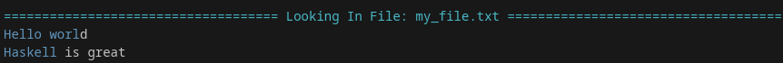

# h-grep

This is a demo project that implements a simple `grep`-like tool using a regular expression engine and a monadic parser built from scratch in Haskell.

## What it does

`h-grep` searches for a regular expression pattern within a text file or directory and prints the lines that contain a match.

## How to Build

You will need [GHC](https://www.haskell.org/ghc/) and [Cabal](https://www.haskell.org/cabal/) installed.

1.  Clone the repository:
    ```bash
    git clone https://github.com/Buty800/h-grep.git
    cd h-grep
    ```

2.  Build the project with `cabal`:
    ```bash
    cabal build
    ```

3.  The executable will be located at `dist-newstyle/build/.../h-grep`.
    You can run it directly or use `cabal run`:

## How to Use

```bash
# The format is: cabal run h-grep -- [OPTIONS] PATTERN [FILE/PATH]
# (The '--' separates cabal's arguments from your program's arguments)

cabal run h-grep -- "world" my_file.txt
```

### Example

If `my_file.txt` contains:

```
Hello world
this is a test
Haskell is great
goodbye world
```

The command `cabal run h-grep -- "H.*l" my_file.txt` will print:



If instead a path is passed, the command will search recursively for the pattern.  

In the proyect directory, the command `cabal run h-grep -- "\d\d\d+" ./src` will print:


**Note:**
Running the command without specifing a file or path will start recursevly searching in the current directory

## Available Flags

| Flag | Long Flag | Description |
| :--- | :--- | :--- |
| -h | --help | Displays help message and exits. |
| -n |	--number |	Displays the line number for each match.
| -v |--verbose	| Shows detailed error messages (e.g., permission denied).

## Supported Regex Syntax

This project uses a custom-built parser. The supported syntax is as follows:

| Syntax | Description | Example |
| :--- | :--- | :--- |
| `ab` | **Concatenation** | Matches `a` followed by `b`. |
| `a\|b` | **Union** | Matches `a` or `b`. |
| `a*` | **Kleene Star** | Matches zero or more `a`'s. |
| `a+` | **One or More** | Matches one or more `a`'s. |
| `a?` | **Optional** | Matches zero or one `a`. |
| `(expr)` | **Grouping** | Groups an expression. `(a\|b)c` matches `ac` or `bc`. |
| `.` | **Any Character** | Matches any single ASCII character. |
| `()` | **Empty String** | Matches the empty string. |
| `\d` | **Digit Class** | Matches any digit (`0` through `9`). |
| `\a` | **Alpha Class** | Matches any letter (`a-z`, `A-Z`). |
| `\` | **Escape Character** | Treats the next character literally. |